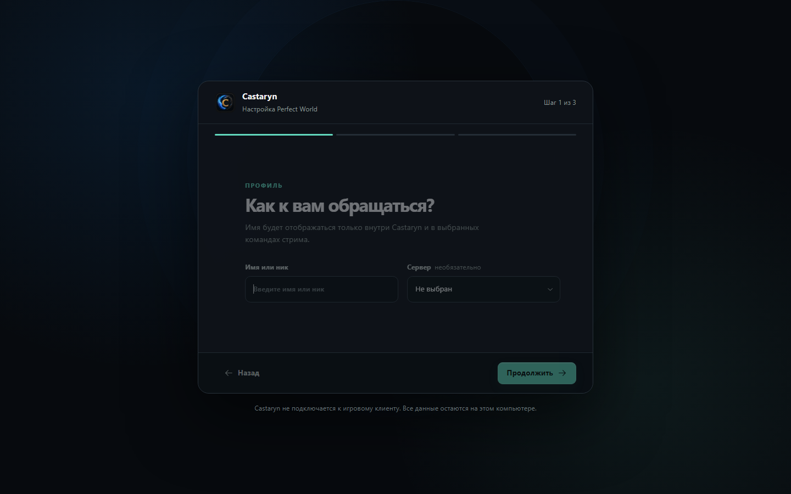
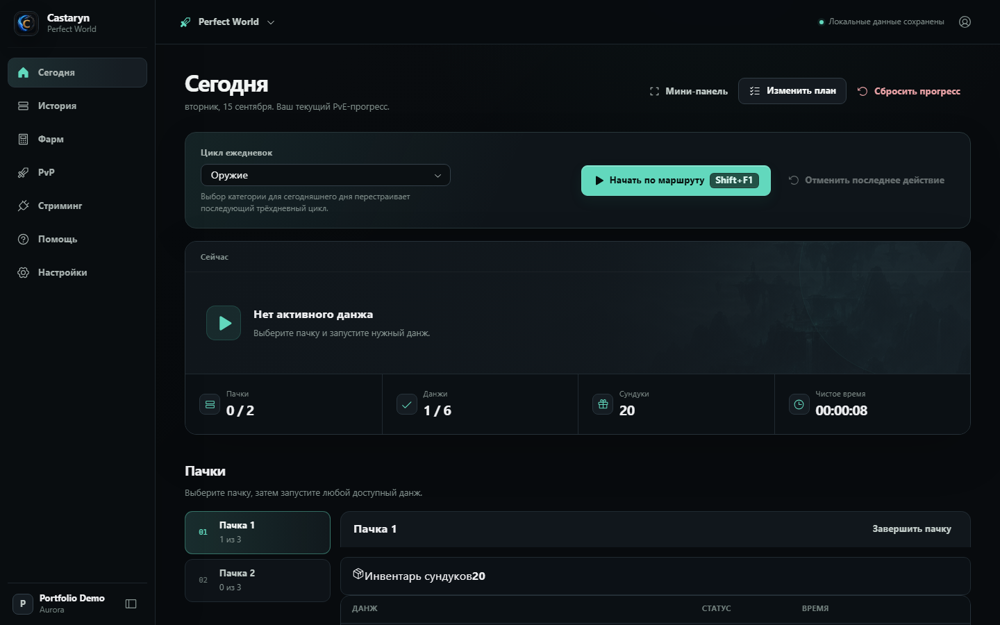

# Castaryn

Castaryn 0.1.6 — Windows companion для игроков Perfect World и стримеров.
Портфолио-история проекта — это локальный Player: он работает без аккаунта и
сетевого сервиса, хранит состояние локально и помогает вручную планировать
ежедневный PvE-маршрут, награды и фарм.

## Скриншоты

Первый запуск и настройка локального профиля:



Главный экран Player с планом пачек, прогрессом и локальным состоянием:



Снимки сделаны из локального demo-state (`Portfolio Demo`, сервер `Aurora`).
Они не показывают внешний аккаунт, реальные игровые данные или подключённый
Creator-сервис.

## Фактически работающий local-first scope

- onboarding для одного персонажа или multi-window режима;
- постоянный PvE-план до 20 пачек, выбранные данжи и ежедневный цикл категорий
  лута;
- ручной запуск и завершение данжа, таймер, награды по слотам и история дней;
- калькулятор фарма: прогноз, весь локальный инвентарь или выбранные пачки,
  локальные цены и сохранение расчётов;
- ручной PvP-трекер для Арены Авроры и Императорской битвы;
- встроенная помощь, настройки интерфейса, локальный backup/import и undo
  последнего действия;
- compact panel и Windows hotkey-контур реализованы в desktop-части, но
  требуют отдельной проверки на физическом native-окне.

Castaryn не подключается к клиенту Perfect World, не читает процессы или файлы
игры, не автоматизирует ввод и не собирает игровые данные автоматически.
PvE- и PvP-учёт выполняется вручную.

## Архитектура

```text
Tauri WebView
    │
    ├── React 19 / TypeScript / Vite
    │       └── Zustand store
    │             └── desktop-storage
    │                   ├── browser fallback для dev/smoke
    │                   └── Tauri commands → Rust validation → SQLite
    │
    └── отдельные workspace-контуры:
        Creator API · Admin · public Site · Telegram Admin
```

Player не зависит от Creator API. Серверная часть вынесена в отдельные
workspace-пакеты и имеет собственные auth, PostgreSQL, OAuth и overlay-контуры.

## Stack

- Tauri 2 / Rust / SQLite;
- React 19 / TypeScript / Vite;
- Zustand, Radix Themes, Phosphor Icons;
- Vitest, ESLint, pnpm workspaces;
- Creator API на Fastify с отдельными Admin, Site и Telegram Admin приложениями.

## Запуск

Требования: Windows, Node.js `>=22 <25`, pnpm `11.9.0`, Rust и Windows
toolchain для Tauri.

```bash
pnpm install --frozen-lockfile
```

Web preview:

```bash
pnpm dev
```

Native desktop dev:

```bash
pnpm tauri dev
```

## Проверки и сборка

Основной quality gate:

```bash
pnpm check
pnpm security:check
pnpm build
pnpm creator:build
pnpm admin:build
pnpm site:build
pnpm telegram:build
```

Rust quality gate:

```bash
cargo fmt --check --manifest-path src-tauri/Cargo.toml
cargo clippy --locked --manifest-path src-tauri/Cargo.toml --all-targets --all-features -- -D warnings
cargo check --locked --manifest-path src-tauri/Cargo.toml
cargo test --locked --manifest-path src-tauri/Cargo.toml
cargo audit --file src-tauri/Cargo.lock
```

Windows artifacts:

```bash
pnpm tauri build --no-bundle
pnpm release:player:windows
```

## Что проверено

На текущем checkout, 15 сентября 2026 года:

- frontend: 55 тестов;
- Creator API: 107 тестов, 3 штатно skipped;
- Admin: 14 тестов;
- Telegram Admin: 3 теста;
- Rust: 28 тестов;
- lint, TypeScript checks, workspace builds, `cargo fmt`, clippy, check и audit;
- JS security audit: 0 известных уязвимостей, 509 проверенных registry
  signatures;
- release executable и NSIS installer с offline WebView2;
- browser smoke основных local-first экранов без console errors и broken images.

## Limitations / External integrations

Следующие заявления намеренно не делаются: Twitch/YouTube/OBS не считаются
production-tested.

- Реальные Twitch и YouTube OAuth exchanges, live chat и OBS Browser Source не
  подтверждены внешним аккаунтом или live-каналом.
- Creator API, Keycloak, PostgreSQL integration, Telegram delivery и Docker
  deployment не запускались как реальные внешние сервисы в этой приёмке.
- Native tray, global hotkeys, compact window, Windows file dialogs для backup/
  import и persistence установленного Tauri-приложения требуют ручной проверки.
- Installer собран, но не подписан Authenticode и не устанавливался на чистую
  систему.
- `cargo audit` завершается успешно; остаются policy-allowed предупреждения о
  нескольких транзитивных unmaintained/unsound/yanked crates.

## Public repository boundary

В public snapshot должны попасть исходники Player, тесты, конфигурация сборки,
`.env.example` без реальных секретов, документация и эти screenshots.

Никогда не добавляй реальные `.env`, OAuth/API keys, private keys, токены,
локальные базы, backups, generated `dist`/`target`/`node_modules`, логи и
Windows installers. Эти пути исключены через `.gitignore`, но перед публикацией
их всё равно нужно проверить в staged snapshot.

Подробное описание продукта: [docs/PRODUCT_OVERVIEW.md](docs/PRODUCT_OVERVIEW.md).
